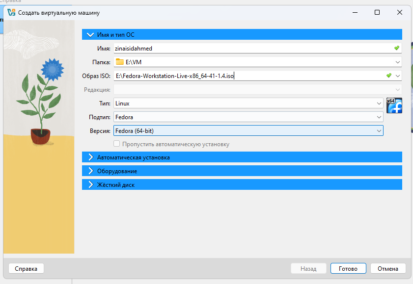
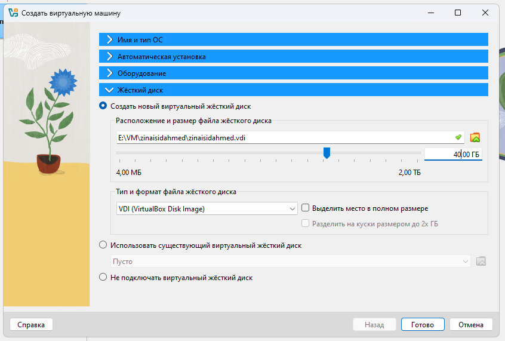
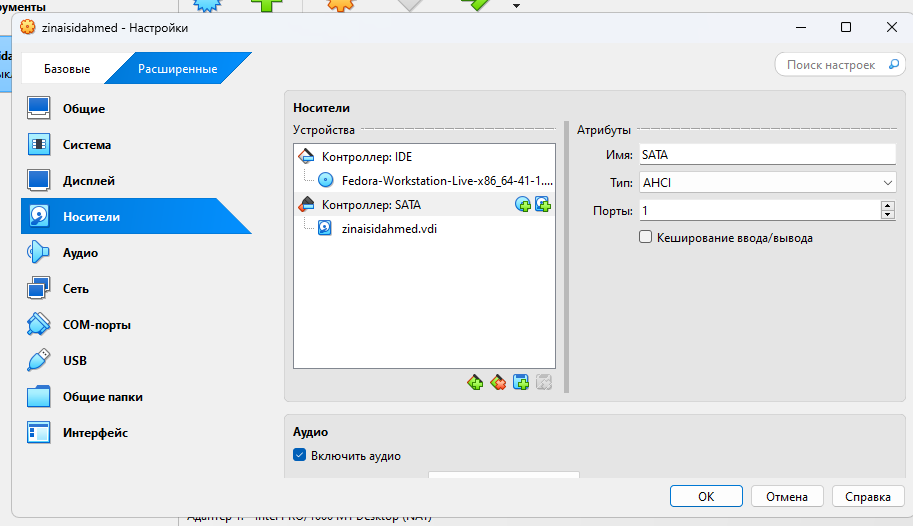
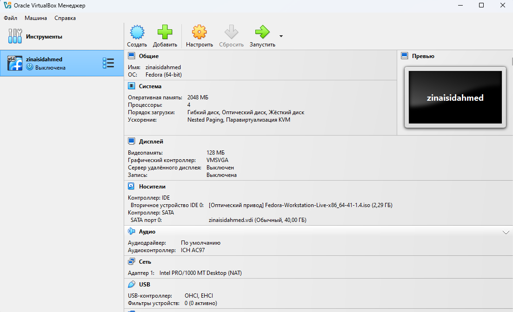
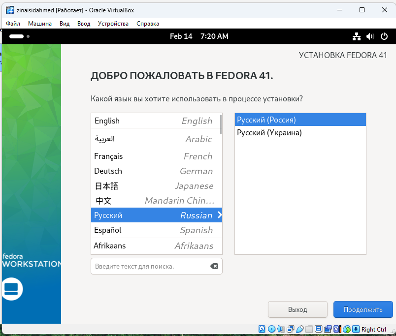
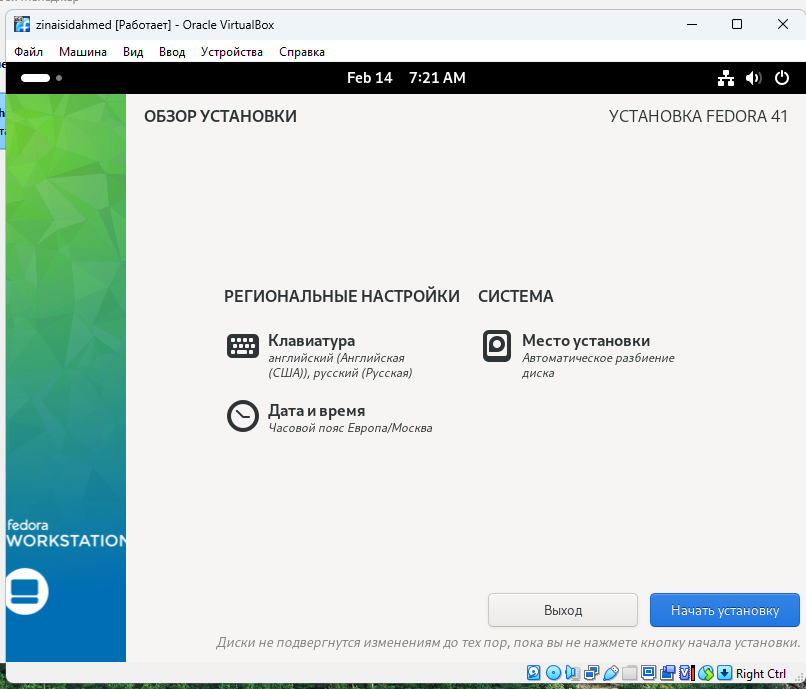
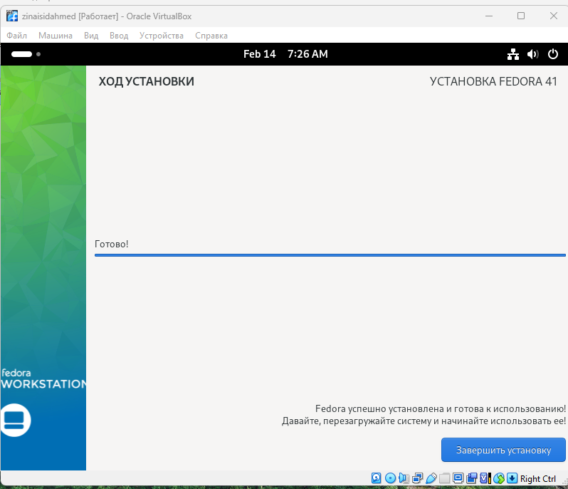
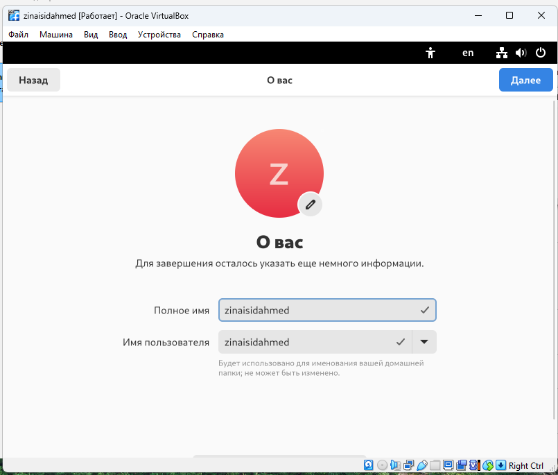
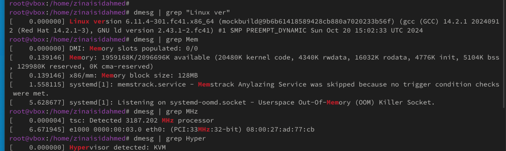
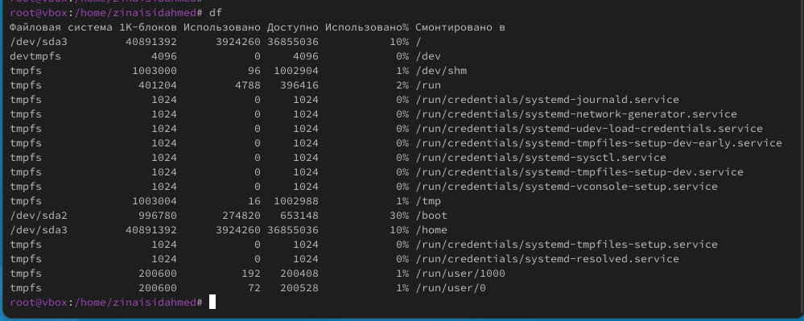

---
## Front matter
lang: ru-RU
title: Операционные системы
subtitle: Установка ОС на виртуальную машину
author:
  - Зиани Сид-Ахмед
institute:
  - Российский университет дружбы народов, Москва, Россия
date: 14 февраля 2025

## i18n babel
babel-lang: russian
babel-otherlangs: english

## Formatting pdf
toc: false
toc-title: Содержание
slide_level: 2
aspectratio: 169
section-titles: true
theme: metropolis
header-includes:
 - \metroset{progressbar=frametitle,sectionpage=progressbar,numbering=fraction}
---

# Цели и задачи работы

## Цель лабораторной работы

Целью данной работы является приобретение практических навыков установки операционной системы на виртуальную машину, настройки минимально необходимых для дальнейшей работы сервисов

# Процесс выполнения лабораторной работы

## Создаю виртуальную машину

{ #fig:001 width=70% height=70% }

## Задаю конфигурацию жёсткого диска

{ #fig:002 width=70% height=70% }

## Задаю конфигурацию жёсткого диска

{ #fig:003 width=70% height=70% }

## Добавляю новый привод оптических дисков и выбираю образ 

{ #fig:004 width=70% height=70% }

## Установка языка

{ #fig:005 width=70% height=70% }

## Параметры установки

{ #fig:006 width=70% height=70% }

## Установка

{ #fig:007 width=70% height=70% }

## Создание пользователя

{ #fig:008 width=70% height=70% }

## Рабочая система

{ #fig:009 width=70% height=70% }

## Рабочая система

{ #fig:010 width=70% height=70% }

# Выводы по проделанной работе

## Вывод

Мы приобрели практические навыки установки операционной системы на виртуальную машину, настройки минимально необходимых для дальнейшей работы сервисов.