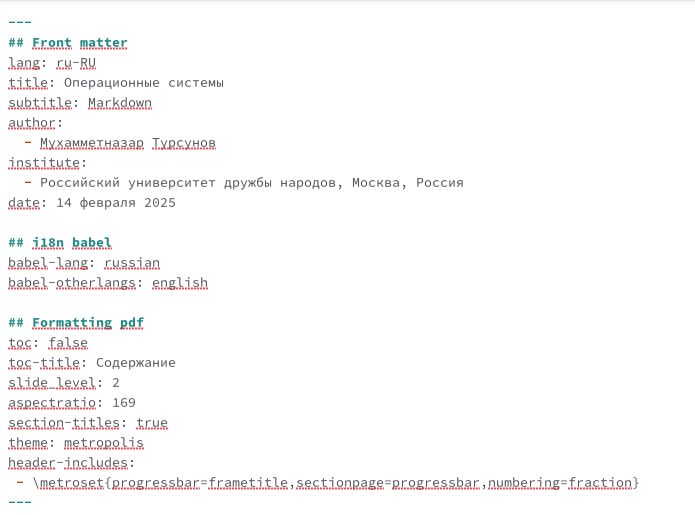
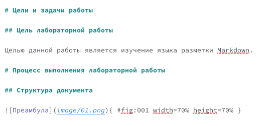
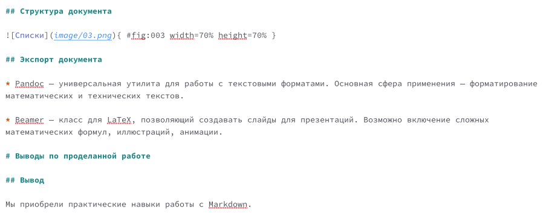

---
## Front matter
lang: ru-RU
title: Операционные системы
subtitle: Markdown
author:
  - Зиани Сид-Ахмед
institute:
  - Российский университет дружбы народов, Москва, Россия
date: 14 февраля 2025

## i18n babel
babel-lang: russian
babel-otherlangs: english

## Formatting pdf
toc: false
toc-title: Содержание
slide_level: 2
aspectratio: 169
section-titles: true
theme: metropolis
header-includes:
 - \metroset{progressbar=frametitle,sectionpage=progressbar,numbering=fraction}
---

# Цели и задачи работы

## Цель лабораторной работы

Целью данной работы является изучение языка разметки Markdown.

# Процесс выполнения лабораторной работы

## Структура документа

{ #fig:001 width=70% height=70% }

## Структура документа

{ #fig:002 width=70% height=70% }

## Структура документа

{ #fig:003 width=70% height=70% }

## Экспорт документа

* Pandoc — универсальная утилита для работы с текстовыми форматами. Основная сфера применения — форматирование математических и технических текстов.

* Beamer — класс для LaTeX, позволяющий создавать слайды для презентаций. Возможно включение сложных математических формул, иллюстраций, анимации.

# Выводы по проделанной работе

## Вывод

Мы приобрели практические навыки работы с Markdown.