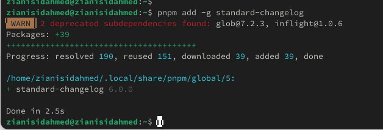

---
## Front matter
lang: ru-RU
title: Операционные системы
subtitle: Продвинутое использование git
author:
  - Зиани Сид-Ахмед
institute:
  - Российский университет дружбы народов, Москва, Россия
date: 14 февраля 2025

## i18n babel
babel-lang: russian
babel-otherlangs: english

## Formatting pdf
toc: false
toc-title: Содержание
slide_level: 2
aspectratio: 169
section-titles: true
theme: metropolis
header-includes:
 - \metroset{progressbar=frametitle,sectionpage=progressbar,numbering=fraction}
---

# Цели и задачи работы

## Цель лабораторной работы

Получение навыков правильной работы с репозиториями git.

## Задачи лабораторной работы

1 Выполнить работу для тестового репозитория.

2 Преобразовать рабочий репозиторий в репозиторий с git-flow и conventional commits.

# Процесс выполнения лабораторной работы

## Node.js

{ #fig:001 width=70% height=70% }

## commitizen

{ #fig:002 width=70% height=70% }

## standard-changelog

{ #fig:003 width=70% height=70% }

## package.json

{ #fig:004 width=70% height=70% }

## Использование commitizen

{ #fig:005 width=70% height=70% }

## git-flow

{ #fig:006 width=70% height=70% }

## git-flow

{ #fig:007 width=70% height=70% }

## Отправим данные на github

{ #fig:008 width=70% height=70% }

## Объединение веток

{ #fig:009 width=70% height=70% }

## git-flow

{ #fig:010 width=70% height=70% }

## Подготовка рабочего репозитория

{ #fig:011 width=70% height=70% }

## Подготовка рабочего репозитория

{ #fig:012 width=70% height=70% }

# Выводы по проделанной работе

## Вывод

Мы приобрели практические навыки взаимодействия с дополнительными функциями гитхаб.
