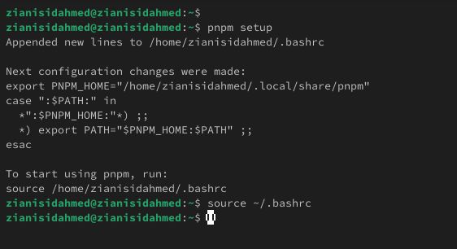
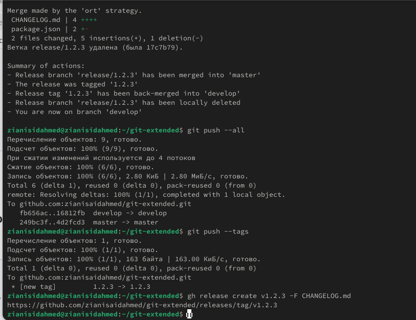

---
## Front matter
title: "Отчёт по лабораторной работе 4"
subtitle: "Продвинутое использование git"
author: "Зиани Сид-Ахмед"

## Generic otions
lang: ru-RU
toc-title: "Содержание"

## Bibliography
bibliography: bib/cite.bib
csl: pandoc/csl/gost-r-7-0-5-2008-numeric.csl

## Pdf output format
toc: true # Table of contents
toc-depth: 2
lof: true # List of figures
lot: true # List of tables
fontsize: 12pt
linestretch: 1.5
papersize: a4
documentclass: scrreprt
## I18n polyglossia
polyglossia-lang:
  name: russian
  options:
	- spelling=modern
	- babelshorthands=true
polyglossia-otherlangs:
  name: english
## I18n babel
babel-lang: russian
babel-otherlangs: english
## Fonts
mainfont: IBM Plex Serif
romanfont: IBM Plex Serif
sansfont: IBM Plex Sans
monofont: IBM Plex Mono
mathfont: STIX Two Math
mainfontoptions: Ligatures=Common,Ligatures=TeX,Scale=0.94
romanfontoptions: Ligatures=Common,Ligatures=TeX,Scale=0.94
sansfontoptions: Ligatures=Common,Ligatures=TeX,Scale=MatchLowercase,Scale=0.94
monofontoptions: Scale=MatchLowercase,Scale=0.94,FakeStretch=0.9
mathfontoptions:
## Biblatex
biblatex: true
biblio-style: "gost-numeric"
biblatexoptions:
  - parentracker=true
  - backend=biber
  - hyperref=auto
  - language=auto
  - autolang=other*
  - citestyle=gost-numeric
## Pandoc-crossref LaTeX customization
figureTitle: "Рис."
tableTitle: "Таблица"
listingTitle: "Листинг"
lofTitle: "Список иллюстраций"
lotTitle: "Список таблиц"
lolTitle: "Листинги"
## Misc options
indent: true
header-includes:
  - \usepackage{indentfirst}
  - \usepackage{float} # keep figures where there are in the text
  - \floatplacement{figure}{H} # keep figures where there are in the text
---

# Цель работы

Получение навыков правильной работы с репозиториями git.

# Теоретические сведения

* Gitflow Workflow опубликована и популяризована Винсентом Дриссеном.

* Gitflow Workflow предполагает выстраивание строгой модели ветвления с учётом выпуска проекта.

* Данная модель отлично подходит для организации рабочего процесса на основе релизов.

* Работа по модели Gitflow включает создание отдельной ветки для исправлений ошибок в рабочей среде.

* Последовательность действий при работе по модели Gitflow:

* Из ветки master создаётся ветка develop.

* Из ветки develop создаётся ветка release.

* Из ветки develop создаются ветки feature.

* Когда работа над веткой feature завершена, она сливается с веткой develop.

* Когда работа над веткой релиза release завершена, она сливается в ветки develop и master.

* Если в master обнаружена проблема, из master создаётся ветка hotfix.

* Когда работа над веткой исправления hotfix завершена, она сливается в ветки develop и master.

# Выполнение лабораторной работы

## Работа с тестовым репозиторием

Для работы с Node.js добавим каталог с исполняемыми файлами, 
устанавливаемыми yarn, в переменную PATH.

{ #fig:001 width=70% height=70% }

Программа commitizen используется для помощи в форматировании коммитов.
При этом устанавливается скрипт git-cz, который мы и будем использовать для коммитов.

{ #fig:002 width=70% height=70% }

Программа standard-changelog используется для помощи в создании логов.

{ #fig:003 width=70% height=70% }

Делаем первый коммит и выкладываем на github.

Необходимо заполнить несколько параметров пакета.

Таким образом, файл package.json приобретает вид:

{ #fig:004 width=70% height=70% }

Добавим новые файлы.

Выполним коммит.

Отправим на github.

{ #fig:005 width=70% height=70% }

Инициализируем git-flow

Проверьте, что Вы на ветке develop

Загрузите весь репозиторий в хранилище

{ #fig:006 width=70% height=70% }

Установите внешнюю ветку как вышестоящую для этой ветки

Создадим релиз с версией 1.0.0

Создадим журнал изменений

Добавим журнал изменений в индекс

Зальём релизную ветку в основную ветку

{ #fig:007 width=70% height=70% }

Отправим данные на github

{ #fig:008 width=70% height=70% }

Создадим ветку для новой функциональности
По окончании разработки новой функциональности следующим шагом следует объединить ветку feature_branch c develop:

{ #fig:009 width=70% height=70% }

Создадим релиз с версией 1.2.3

Обновите номер версии в файле package.json. Установите её в 1.2.3

Создадим журнал изменений

Добавим журнал изменений в индекс

Зальём релизную ветку в основную ветку

{ #fig:010 width=70% height=70% }

## Подготовка рабочего репозитория

{ #fig:011 width=70% height=70% }

{ #fig:012 width=70% height=70% }

# Вывод

Мы приобрели практические навыки взаимодействия с дополнительными функциями гитхаб.
