---
## Front matter
lang: ru-RU
title: Операционные системы
subtitle: Редактор Emacs
author:
  - Зиани Сид-Ахмед
institute:
  - Российский университет дружбы народов, Москва, Россия
date: 5 апреля 2025

## i18n babel
babel-lang: russian
babel-otherlangs: english

## Formatting pdf
toc: false
toc-title: Содержание
slide_level: 2
aspectratio: 169
section-titles: true
theme: metropolis
header-includes:
 - \metroset{progressbar=frametitle,sectionpage=progressbar,numbering=fraction}
---

# Цели и задачи работы

## Цель лабораторной работы

Познакомиться с операционной системой Linux. Получить практические навыки работы с редактором Emacs. 

## Задачи лабораторной работы

1 Изучить возможности редактора Emacs

# Процесс выполнения лабораторной работы

## Выполнение работы

1. Откроем Emacs. 

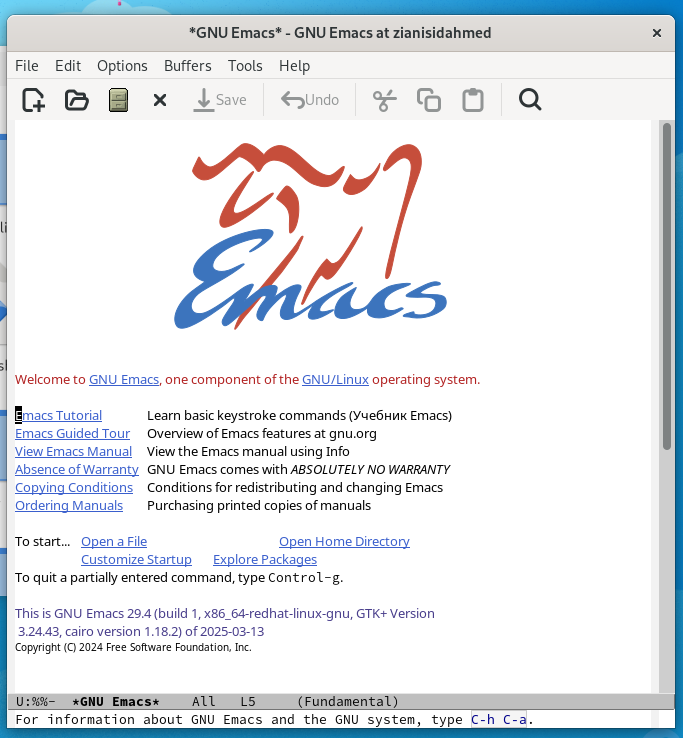{ #fig:001 width=70% height=70%}

## Выполнение работы

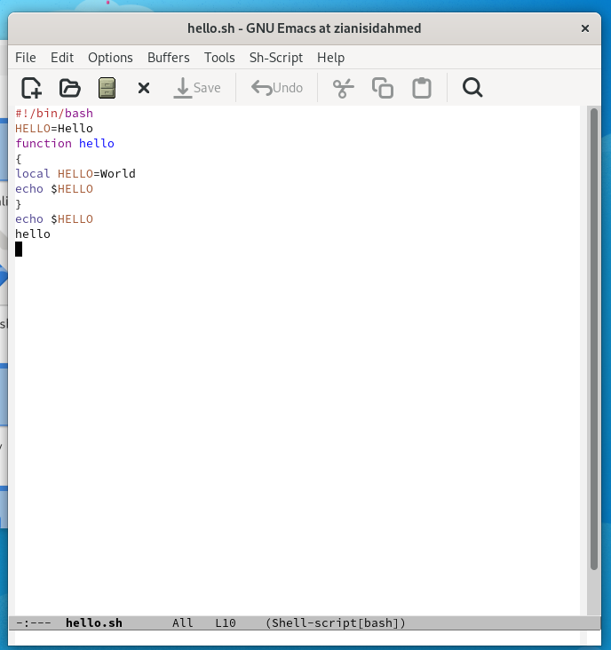{ #fig:002 width=70% height=70%}

## Выполнение работы

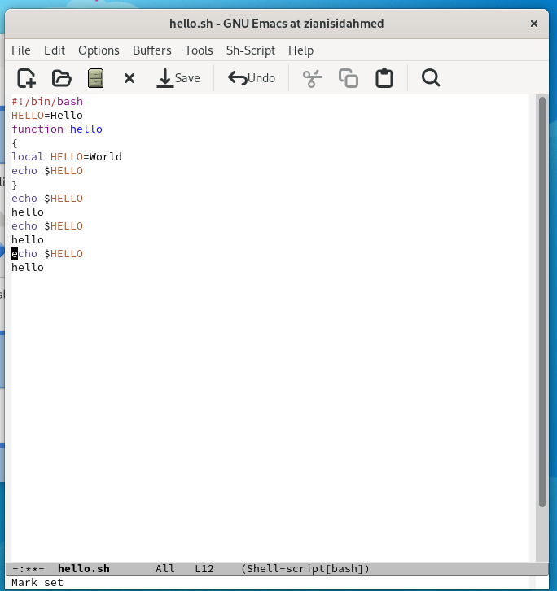{ #fig:003 width=70% height=70%}

## Выполнение работы

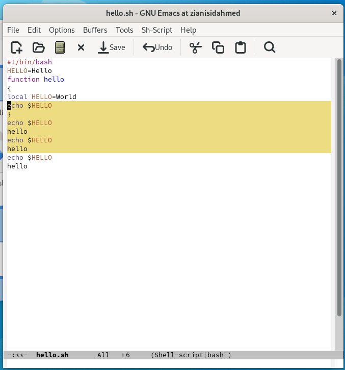{ #fig:004 width=70% height=70%}

## Выполнение работы

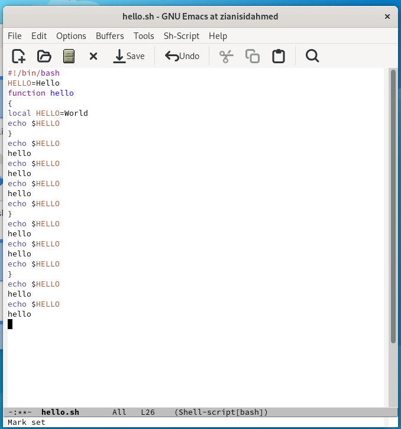{ #fig:005 width=70% height=70%}

## Выполнение работы

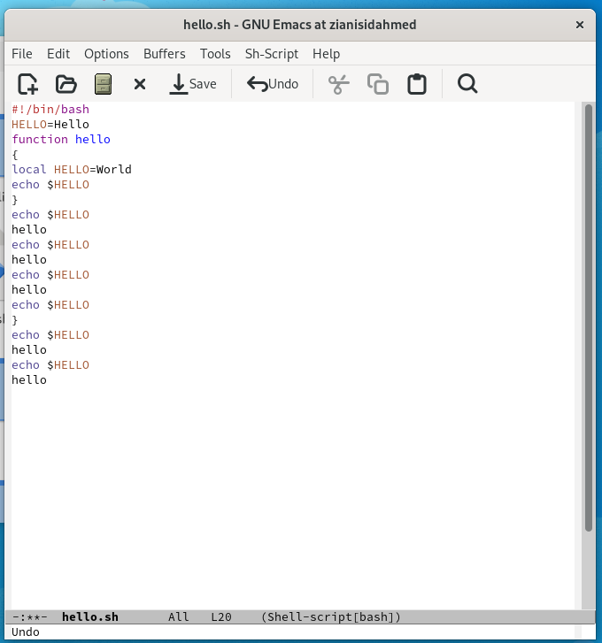{ #fig:006 width=70% height=70%}

## Выполнение работы

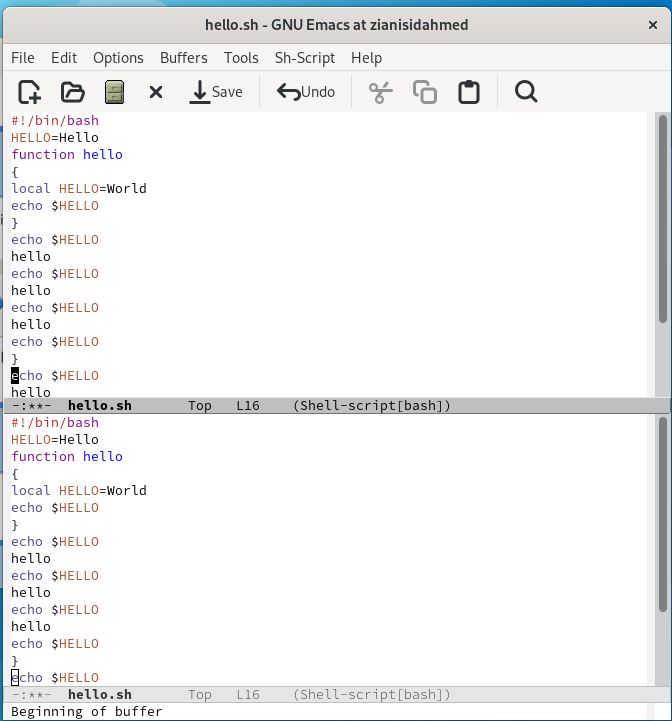{ #fig:007 width=70% height=70%}

## Выполнение работы

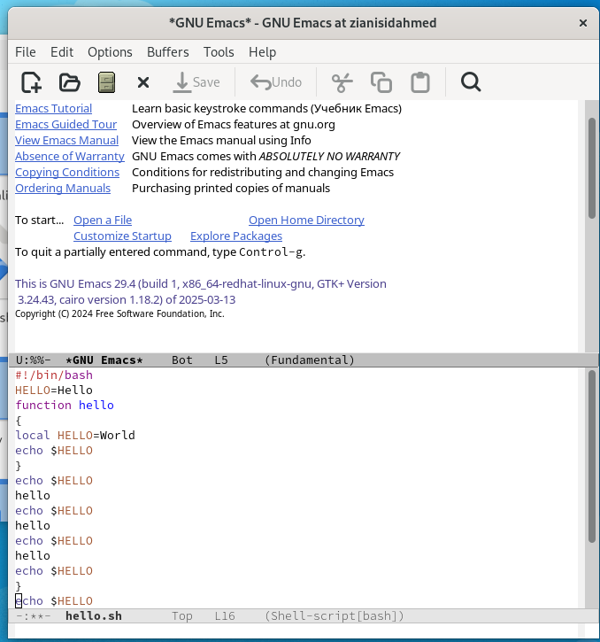{ #fig:008 width=70% height=70%}

## Выполнение работы

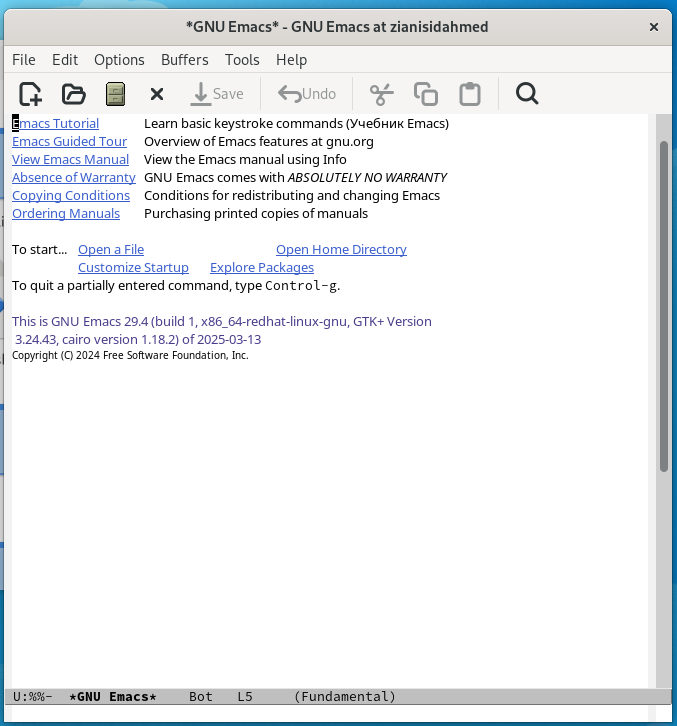{ #fig:009 width=70% height=70%}

## Выполнение работы

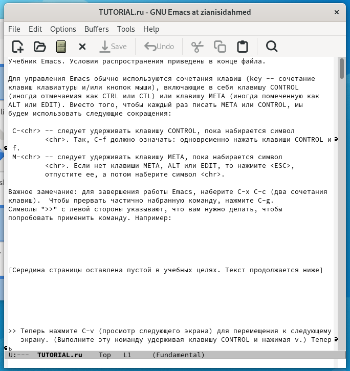{ #fig:010 width=70% height=70%}

## Выполнение работы

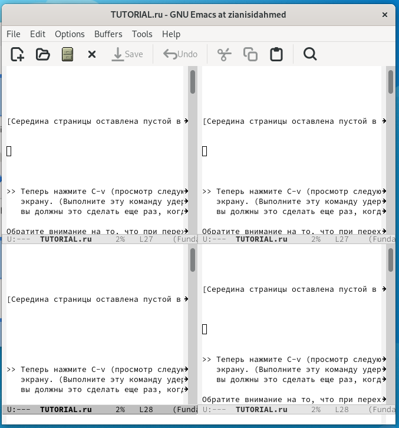{ #fig:011 width=70% height=70%}

## Выполнение работы

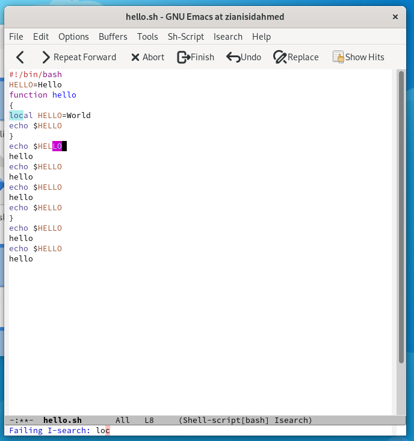{ #fig:012 width=70% height=70%}

# Выводы по проделанной работе

## Вывод

В данной работе мы познакомились с еще одним редактором операционной системой Linux. Получили практические навыки работы с редактором Emacs.
