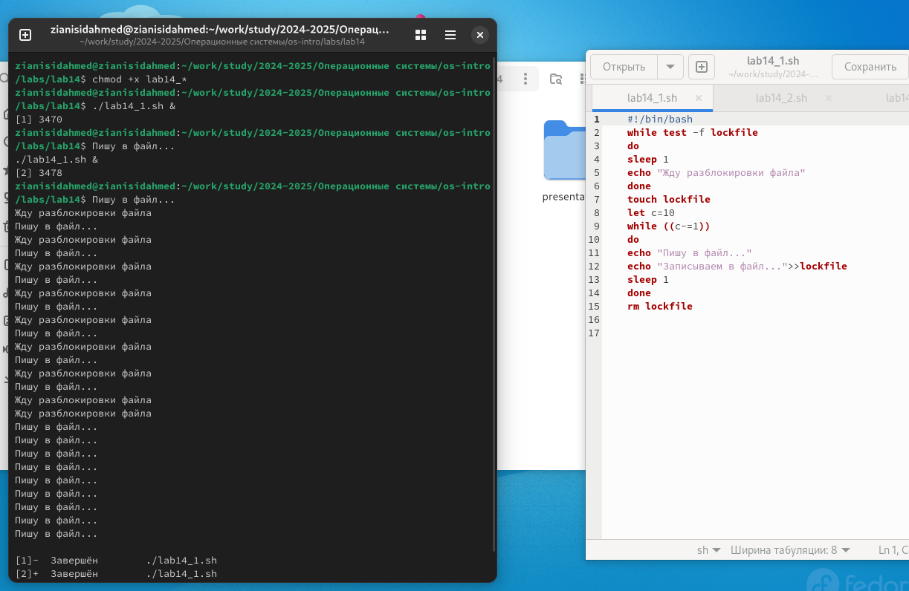
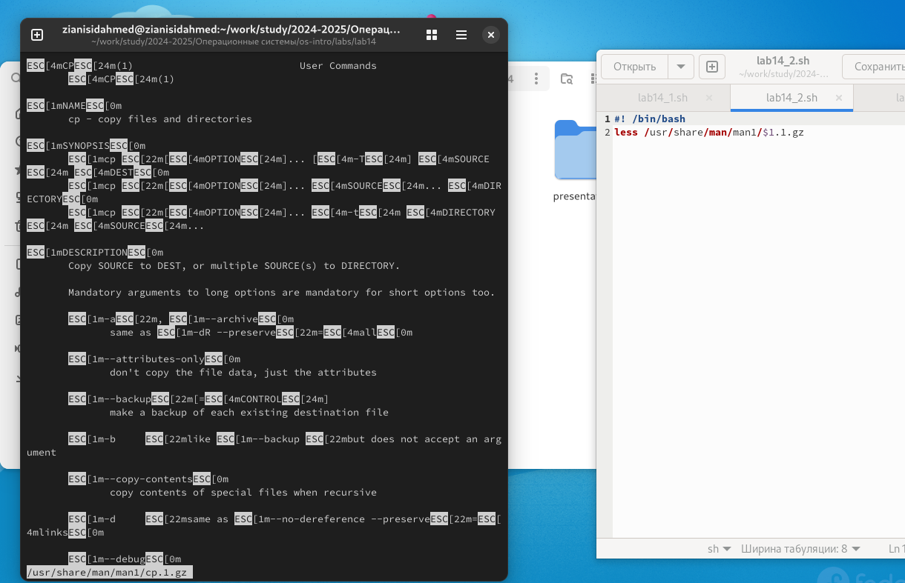
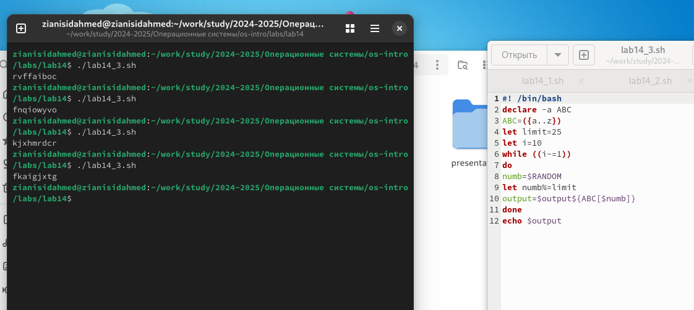

---
## Front matter
lang: ru-RU
title: Операционные системы
subtitle: Программирование в командном процессоре ОС UNIX.
author:
  - Зиани Сид-Ахмед
institute:
  - Российский университет дружбы народов, Москва, Россия
date: 22 апреля 2025

## i18n babel
babel-lang: russian
babel-otherlangs: english

## Formatting pdf
toc: false
toc-title: Содержание
slide_level: 2
aspectratio: 169
section-titles: true
theme: metropolis
header-includes:
 - \metroset{progressbar=frametitle,sectionpage=progressbar,numbering=fraction}
---


# Цели и задачи работы

## Цель лабораторной работы

Изучить основы программирования в оболочке ОС UNIX. Научиться писать более сложные командные файлы с использованием логических управляющих конструкций и циклов

## Задачи лабораторной работы

1 Выполнить 3 задания

# Процесс выполнения лабораторной работы

## Выполнение работы

1. Написали командный файл, реализующий упрощённый механизм семафоров. Командный файл в течение некоторого времени t1 дожидается освобождения ресурса, выдавая об этом сообщение, а дождавшись его освобождения, использует его в течение некоторого времени t2<>t1 , также выдавая информацию о том, что ресурс используется соответствующим командным файлом (процессом).

## Выполнение работы

{ #fig:001 width=70% height=70%}

## Выполнение работы

2. Реализовали команду man с помощью командного файла. Изучили содержимое каталога ```/usr/share/man/man1``` . В нем находятся архивы текстовых файлов, содержащих справку по большинству установленных в системе программ и команд.

## Выполнение работы

{ #fig:002 width=70% height=70%}

## Выполнение работы

3. Используя встроенную переменную $RANDOM , написали командный файл, генерирующий случайную последовательность букв латинского алфавита

## Выполнение работы

{ #fig:003 width=70% height=70%}

# Выводы по проделанной работе

## Вывод

Изучили основы программирования в оболочке ОС UNIX. Научились писать более сложные командные файлы с использованием логических управляющих конструкций и циклов. 