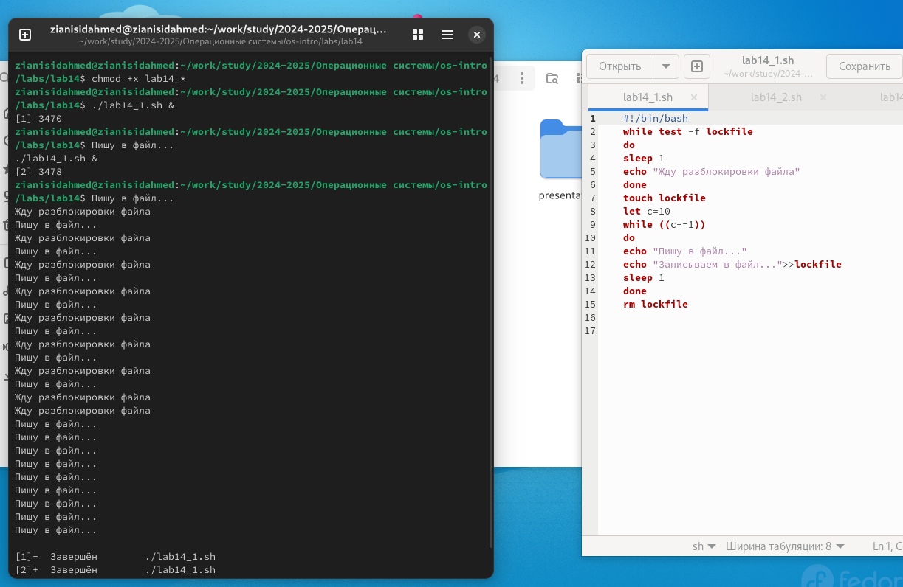
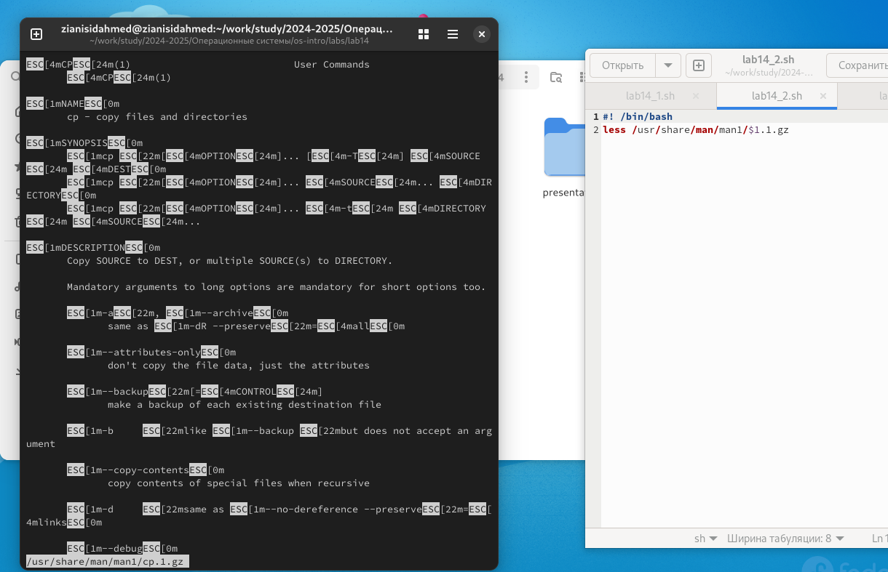
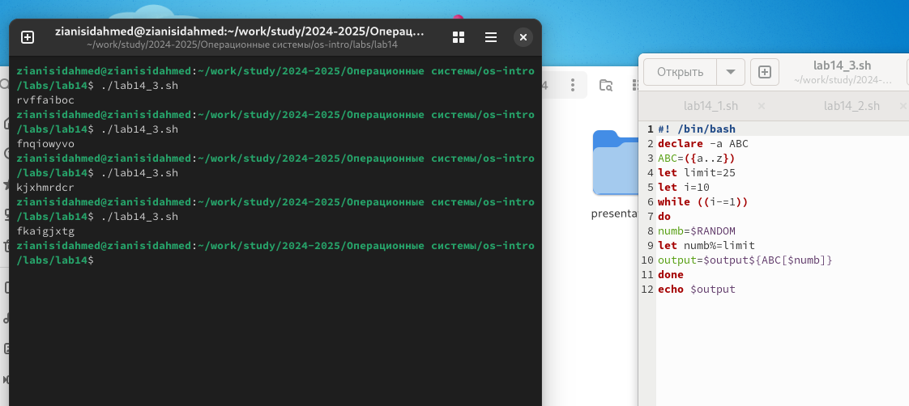

---
## Front matter
title: "Отчёт по лабораторной работе №14"
subtitle: "Программирование в командном процессоре ОС UNIX."
author: "Зиани Сид-Ахмед"

## Generic otions
lang: ru-RU
toc-title: "Содержание"

## Bibliography
bibliography: bib/cite.bib
csl: pandoc/csl/gost-r-7-0-5-2008-numeric.csl

## Pdf output format
toc: true # Table of contents
toc-depth: 2
lof: true # List of figures
lot: true # List of tables
fontsize: 12pt
linestretch: 1.5
papersize: a4
documentclass: scrreprt
## I18n polyglossia
polyglossia-lang:
  name: russian
  options:
	- spelling=modern
	- babelshorthands=true
polyglossia-otherlangs:
  name: english
## I18n babel
babel-lang: russian
babel-otherlangs: english
## Fonts
mainfont: IBM Plex Serif
romanfont: IBM Plex Serif
sansfont: IBM Plex Sans
monofont: IBM Plex Mono
mathfont: STIX Two Math
mainfontoptions: Ligatures=Common,Ligatures=TeX,Scale=0.94
romanfontoptions: Ligatures=Common,Ligatures=TeX,Scale=0.94
sansfontoptions: Ligatures=Common,Ligatures=TeX,Scale=MatchLowercase,Scale=0.94
monofontoptions: Scale=MatchLowercase,Scale=0.94,FakeStretch=0.9
mathfontoptions:
## Biblatex
biblatex: true
biblio-style: "gost-numeric"
biblatexoptions:
  - parentracker=true
  - backend=biber
  - hyperref=auto
  - language=auto
  - autolang=other*
  - citestyle=gost-numeric
## Pandoc-crossref LaTeX customization
figureTitle: "Рис."
tableTitle: "Таблица"
listingTitle: "Листинг"
lofTitle: "Список иллюстраций"
lotTitle: "Список таблиц"
lolTitle: "Листинги"
## Misc options
indent: true
header-includes:
  - \usepackage{indentfirst}
  - \usepackage{float} # keep figures where there are in the text
  - \floatplacement{figure}{H} # keep figures where there are in the text
---

# Цель работы

Изучить основы программирования в оболочке ОС UNIX. Научиться писать более сложные командные файлы с использованием логических управляющих конструкций и циклов

# Выполнение лабораторной работы

1. Написали командный файл, реализующий упрощённый механизм семафоров. Командный файл в течение некоторого времени t1 дожидается освобождения ресурса, выдавая об этом сообщение, а дождавшись его освобождения, использует его в течение некоторого времени t2<>t1 , также выдавая информацию о том, что ресурс используется соответствующим командным файлом (процессом). Запустили командный файл в одном виртуальном терминале в фоновом режиме, перенаправив его вывод в другой ( ```> /dev/tty#``` , где # — номер терминала куда перенаправляется вывод), в котором также запущен этот файл, но не фоновом, а в привилегированном режиме. Доработали программу так, чтобы имелась возможность взаимодействия трёх и более процессов. 
 
{ #fig:001 width=70% }

2. Реализовали команду man с помощью командного файла. Изучили содержимое каталога ```/usr/share/man/man1``` . В нем находятся архивы текстовых файлов, содержащих справку по большинству установленных в системе программ и команд. Каждый архив можно открыть командой less сразу же просмотрев содержимое справки. Командный файл получает в виде аргумента командной строки название команды и в виде результата выдает справку об этой команде или сообщение об отсутствии справки, если соответствующего файла нет в каталоге man1. 

{ #fig:002 width=70% }

3. Используя встроенную переменную $RANDOM , написали командный файл, генерирующий случайную последовательность букв латинского алфавита

{ #fig:003 width=70% }

# Вывод

Изучили основы программирования в оболочке ОС UNIX. Научились писать более сложные командные файлы с использованием логических управляющих конструкций и циклов. 

# Контрольные вопросы

1. Найдите синтаксическую ошибку в следующей строке: 
while ```[$1 != "exit"]``` 
Ответ: Правильный вариант: while ```["$1" != " exit" ]``` 

2. Как объединить (конкатенация) несколько строк в одну? 
Ответ: Объединение нескольких строк в одну в Bash происходит с помощью символа ```‘\’``` 

3. Найдите информацию об утилите seq. Какими иными способами можно реализовать её функционал при программировании на bash? 
Ответ для примера: В Linux имеется программа seq, которая воспринимает в качестве аргументов два числа и выдает последовательность всех чисел, расположенных между заданными. С помощью этой команды можно заставить for в bash работать точно так же, как аналогичный оператор работает в обычных языках программирования. Для этого достаточно записать цикл for следующим образом: 
```
for a in $( seq 1 10 ) ; do 
catfile_$a 
done
``` 
Эта команда выводит на экран содержимое 10-ти файлов:  
"file_1", ..., "file_10". 
 
4. Какой результат даст вычисление выражения ```$((10/3))```? 
Ответ: Так как это целочисленное деление, то произойдет округление в сторону ближайшего числа, и выведется 3. 
10/3 = 3. 

5. Укажите кратко основные отличия командной оболочки zsh от bash. 
Ответ: По размеру Bash больше Zsh. Zsh и Bash предлагают сходный функционал. Обе имеют программируемое дополнение (хотя у Zsh оно появилось раньше), встроенные команды и функции для создания скриптов. У Zsh также в запасе есть несколько собственных хитростей, например, расширенная подстановка имени файла, которая превращает команду поиска find почти что в ненужное излишество. Включение в путь ```**``` означает соответствие любому символу, включая разделитель - слэш, поэтому ```**/*.jpg``` касается всех файлов ```*.jpg``` в текущей директории и в любых поддиректориях. Мало того, сюда также включаются права доступа к файлу, владелец, тип или отметка времени – большинство опций, предусмотренных find. Например, можно использовать ls -l ```/**/bin/*(s) для вывода списка всех setuid-файлов в /bin, /usr/bin и /usr/local/bin```. При наборе имени директории в командной строке Zsh переключается на эту директорию. Выполнение скриптов в Zsh основном быстрее, чем в Bash – по большей части примерно на 20% – однако Zsh разработан для интерактивного пользования В Zsh расширенная подстановка имени файла и более развитая опция дополнения..  
 
6. Проверьте, верен ли синтаксис данной конструкции ```for ((a=1; a <= LIMIT; a++))```
Ответ: В bash для оператора цикла for существует другая конструкция.  
Пример: 
``` 
for A in Ai Bi Ci do  
echo A 
done 
на терминал будет выведено :  
Ai Bi Ci 
```

7. Сравните язык bash с какими-либо языками программирования. Какие преимущества у bash по сравнению с ними? Какие недостатки? 
Ответ: Вначале был Bourne Shell (sh), его написал Стивен Борн для Bell Labs Research Unix. Bash – это Bourne Again Shell (Снова Оболочка Борна), который, к счастью, редко используется. Почти все современные дистрибутивы Linux используют Bash в качестве оболочки по умолчанию, и это превращает Bash в фактический стандарт, с которым сравниваются все остальные. 
Дело не в малом размере Bash, и не в скорости. По размеру Bash больше некоторых оболочек, кроме одной: Sash, которая не использует библиотек и имеет несколько дополнительных встроенных команд. Bash также и не самая быстрая оболочка, однако большинству пользователей это неважно, ибо подлинно важна его гибкость. Bash обладает некоторыми функциями, превосходящими стандарт POSIX, хотя при желании можно добиться от него и POSIX-поведения. Если запустить Bash командой sh, с опцией командной строки --posix или при установленной переменной окружения POSIXLY_CORRECT, Bash будет работать как стандартная оболочка POSIX. При запуске через sh, Bash по возможности пытается работать как исходная оболочка Борна, но лишь в тех ситуациях, когда это не вступит в конфликт со стандартом POSIX. 

